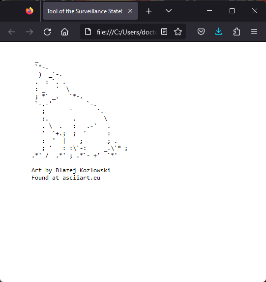

# Progressive Web Applications (PWA) Challenge: Text Editor
```
    /\_____/\
   /  o   o  \
  ( ==  ^  == )
   )         (
  (           )
 ( (  )   (  ) )
(__(__)___(__)__)
```

## Description

Due to time constraints, this project could not be completed as described.

Instead, it is an app that shows ASCII art of a cat.

## Usage instructions

Run the `index.html` in your web browser

## screencap



## future development

In future releases, plans are already underway to put into place a startegy to begin to approach development of innovating the first steps of the planning phases of starting to build the app